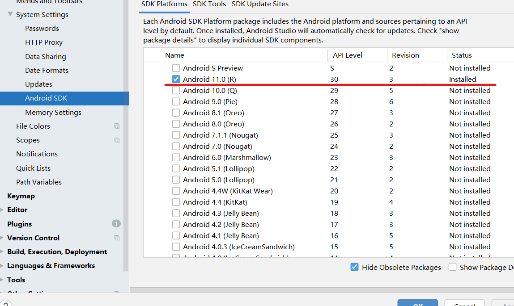

# 实验五：搭建Android模拟器环境  
## 实验要求  
1. 安装和配置 Java SDK  
2. 安装 Android Studio 4.1.2  
3. 下载安装 Android SDK  
4. 配置 Android 模拟器运行环境  
5. 配置 Gradle 编译环境  
## 实验环境  
1. Windows 10  
2. Android Studio 4.1.2  
  
## 实验过程  
### 安装 Java SDK  
* Java SDK 版本的选择  
参考[Java 官方版本支持计划](https://www.oracle.com/java/technologies/java-se-support-roadmap.html)，首选长期支持LTS(Long-Term-Support)版本，确保可获得足够长时间的官方维护和更新支持  
  
  
### 安装 Android Studio 4.1.2  
* 镜像下载[Android Studio](https://developer.android.google.cn/studio#downloads)  
* 按照步骤完成安装  
  
### 下载安装 Android SDK  
* 启动 Android Studio，默认的 SDK 版本为 Android 11.0 (R)  
  
### 配置 Android 模拟器运行环境  
* 在`SDK Tools`界面下载安装`Intel x86 Emulator Accelerator (HAXM installer)`  
  
### 配置 Gradle 编译环境  
* Android Studio Gradle 插件版本  
  

## 参考资料  
[教材第五章实验](https://c4pr1c3.github.io/cuc-mis/chap0x05/exp.html)  
[Java 官方版本支持计划](https://www.oracle.com/java/technologies/java-se-support-roadmap.html)  
[Android Studio 4.1.2](https://developer.android.google.cn/studio#downloads)  

