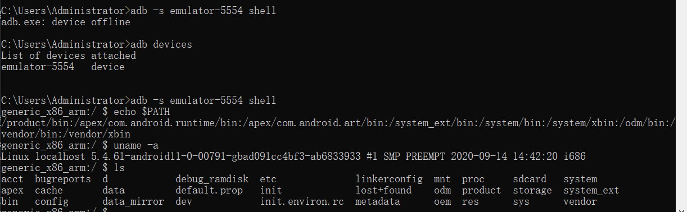
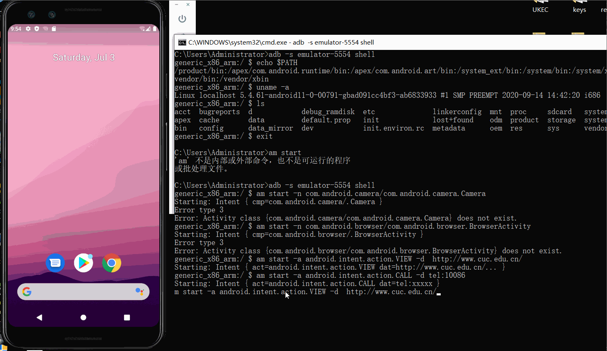
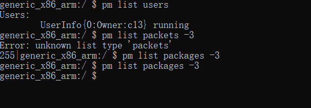
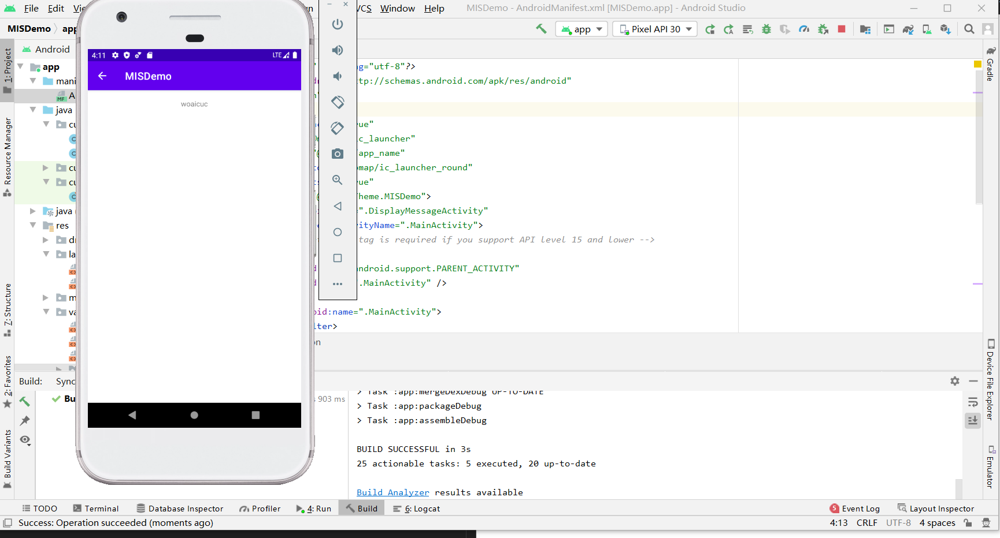
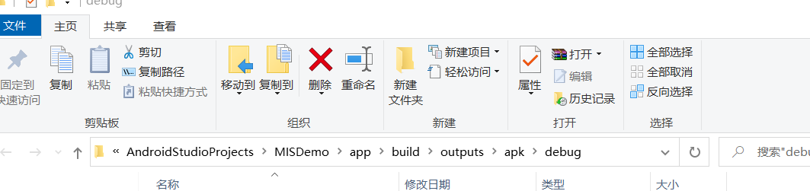

# 实验六：安卓系统访问控制策略与机制  
## 实验目的  
1. 借助`Android Studio`进行安卓程序开发  
## 实验要求  
1. ADB实验  
2. Hello World v1实验  
3. Hello World v2实验  
4. 课后思考  
## 实验环境  
1. Android Studio 4.2.1  
2. Android 11.0 API 30 x86 - Pixel 3  
## 实验过程  
### ADB实验  
* 命令展示  
    ```
    # 查看开启的模拟器
    adb devices
    # 连接模拟器终端
    adb -s emulator-5554 shell
    # 输出环境变量
    echo $PATH
    # 查看系统版本，lsb_release -a 不可用
    uname -a
    # 查看当前目录下文件
    ls
    # 查看防火墙规则
    iptables -nL
    # 查看网络信息
    ifconfig
    # 安装应用
    adb install path_to_apk
    ```  
  
* Activity Manager 实例  
在Android中，除了从界面上启动程序之外，还可以从命令行启动程序，使用的是命令行工具am[命令详解](https://c4pr1c3.github.io/cuc-mis/chap0x06/exp.html)  
    ```
    # Camera（照相机）的启动方法为:
    am start -n com.android.camera/com.android.camera.Camera
    # Browser（浏览器）的启动方法为：
    am start -n com.android.browser/com.android.browser.BrowserActivity
    # 启动浏览器 :
    am start -a android.intent.action.VIEW -d  http://www.cuc.edu.cn/
    # 拨打电话 :
    am start -a android.intent.action.CALL -d tel:10086
    # 发短信：
    adb shell am start -a android.intent.action.SENDTO -d sms:10086 --es sms_body ye --ez exit_on_sent true
    ```  
  
* 软件包管理器 (pm)  
在`adb shell`中，可以使用软件包管理器(pm)工具发出命令，以对设备上安装的应用软件包进行操作和查询  
    ```
    # 输出系统中的所有用户
    pm list users
    # 显示第三方软件包
    pm list packages -3
    ```  
      
* 其他ADB实验  
    ```
    # 常用的按键对应的KEY_CODE
    adb shell input keyevent 22 //焦点去到发送键
    adb shell input keyevent 66 //回车按下

    adb shell input keyevent 4 // 物理返回键
    adb shell input keyevent 3 // 物理HOME键
    ```  
### Hello World v1实验  
根据[官方文档——创建 Android 项目](https://developer.android.google.cn/training/basics/firstapp/creating-project.html)完成实验1  
* Name设置：MISDemo，Company Domain设置：cuc.edu.cn  
* 完成 Hello World v1实验  
  
### 课后思考  
* 按照向导创建的工程在模拟器里运行成功的前提下，生成的APK文件在哪儿保存的？  
  
* 使用`adb shell`是否可以绕过`MainActivity`页面直接“唤起”第二个`DisplayMessageActivity`页面？是否可以在直接唤起的这个`DisplayMessageActivity`页面上显示自定义的一段文字，比如：你好移动互联网安全  
可以  
`adb -s emulator-5554 shell am start -n cuc.edu.cn/cuc.edu.cn.DisplayMessageActivity --es "cuc.edu.cn.MESSAGE" "hello mobile"`  
  
* 如何实现在真机上运行你开发的这个Hello World程序？  
电脑连接真机后直接选择真机并运行  
* 如何修改代码实现通过`adb shell am start -a android.intent.action.VIEW -d http://sec.cuc.edu.cn/`可以让我们的`cuc.edu.cn.misdemo`程序出现在“用于打开浏览器的应用程序选择列表”？  
    ```
    # 在AndroidManifest.xml中添加代码
    <action android:name="android.intent.action.VIEW" />
    <category android:name="android.intent.category.DEFAULT" />
    <category android:name="android.intent.category.BROWSABLE" />
    <data android:scheme="http" />
    <data android:scheme="https" />
    ```  
* 如何修改代码使得应用程序图标在手机主屏幕上实现隐藏？  
    ```
    # 在MainActivity.java中添加代码
    PackageManager packageManager = getPackageManager();
    ComponentName componentName = new ComponentName(MainActivity.this, MainActivity.class);
    packageManager.setComponentEnabledSetting(componentName,
    PackageManager.COMPONENT_ENABLED_STATE_DISABLED, PackageManager.DONT_KILL_APP);
    ```  
## 参考资料  
[教材第六章实验](https://c4pr1c3.github.io/cuc-mis/chap0x06/exp.html)  
[第六章教学视频](https://www.bilibili.com/video/BV1rr4y1A7nz?p=125&spm_id_from=pageDriver)  
[am和pm命令详解](https://c4pr1c3.github.io/cuc-mis/chap0x06/exp.html)