# 实验八：Android 缺陷应用漏洞攻击实验  
## 实验目的  
1. 理解 Android 经典的组件安全和数据安全相关代码缺陷原理和漏洞利用方法  
2. 掌握 Android 模拟器运行环境搭建和`ADB`使用  
## 实验要求  
1. 详细记录实验环境搭建过程  
2. 至少完成以下实验：
    * Developer Backdoor  
    * Insecure Logging  
    * Android Application patching + Weak Auth  
    * Exploiting Android Broadcast Receivers  
    * Exploiting Android Content Provider  
## 实验环境  
1. Android Studio 4.2.1  
2. Android 11.0 API 30 x86 - Pixel  
3. [Android-InsecureBankv2](https://github.com/c4pr1c3/Android-InsecureBankv2)  
4. python 2.7  
## 实验过程  
### 实验环境搭建  
* `git clone git@github.com:c4pr1c3/Android-InsecureBankv2.git` 克隆仓库  
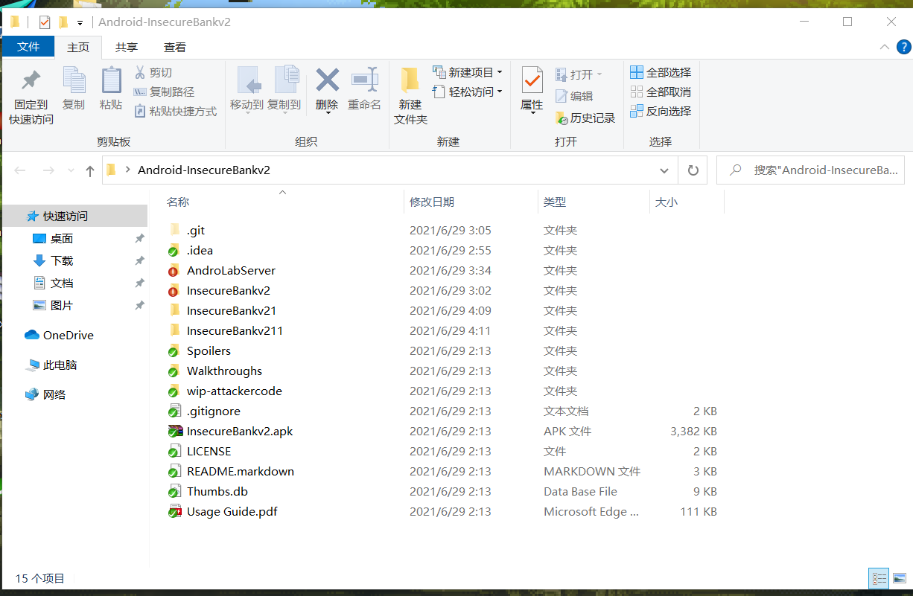  
* 配置`python 2.7`环境  
下载安装`python 2.7`的环境  
* `pip install -r requirements.txt` 安装软件  
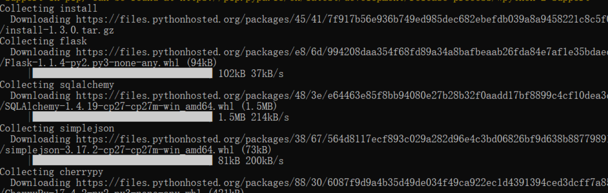  
* `python app.py` 运行服务器  
* `adb install InsecureBankv2.apk` 在ADV上安装APK  
### Developer Backdoor  
* 根据教学视频提示，在代码中寻找存在后门  
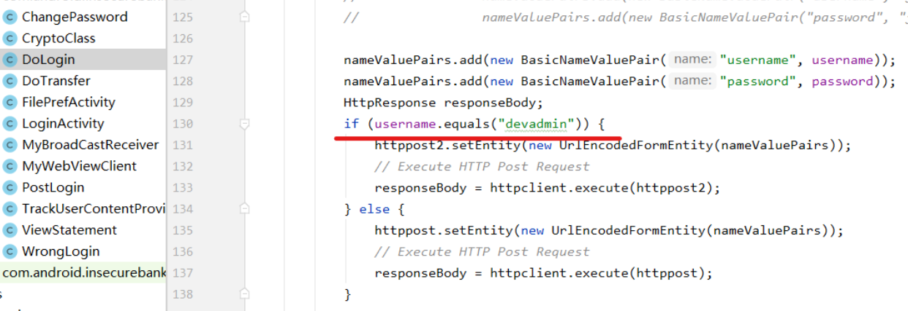  
* 后门存在，当用户名为`devadmin`时，可直接登录  
### Insecure Logging  
`adb logcat > log.txt` 抓取`Jack`登录日志  
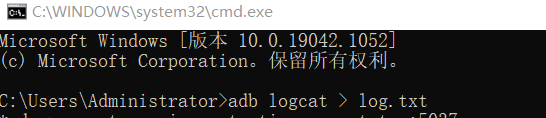  
* 分析日志，发现日志中明文保存登录口令等信息  
### Android Application patching + Weak Auth  
* Visual Studio Code安装`APKlab`扩展实现解码  
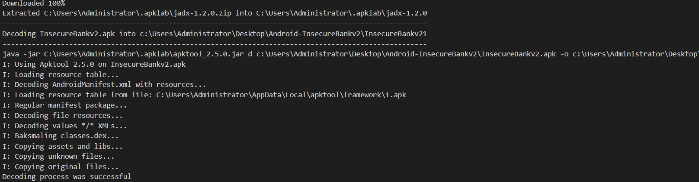  
* 更改`res/values/strings.xml`配置  
* 重新生成目标APK文件  
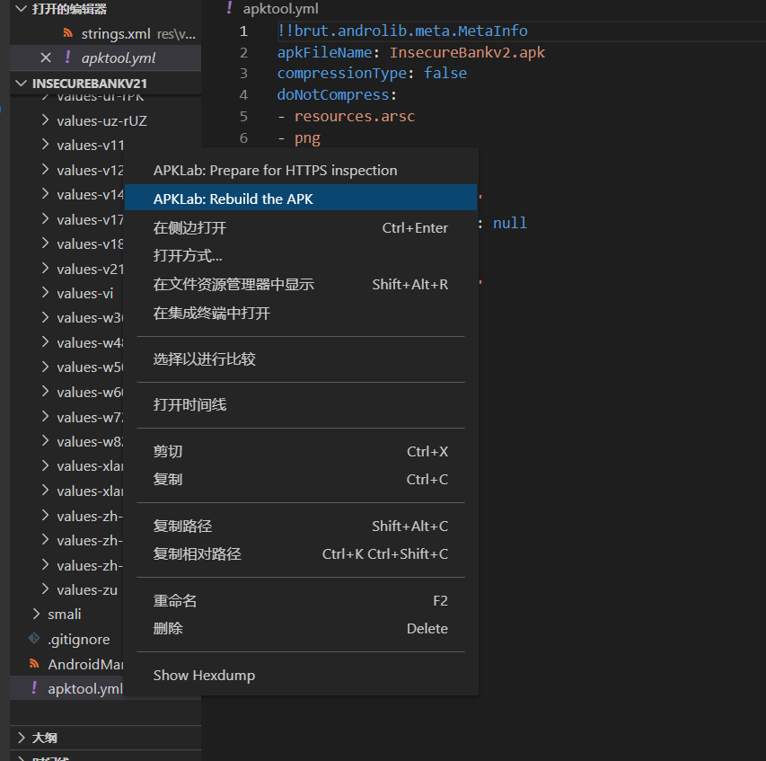  
### Exploiting Android Broadcast Receivers  
* 查看被反编译的`AndroidManifest.xml`  
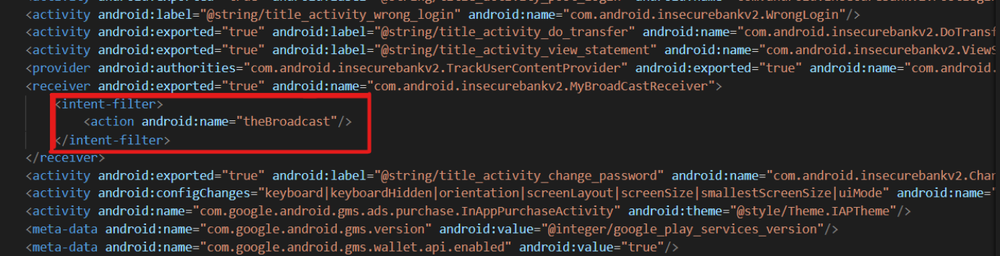  
* 安装相关工具`dex2jar-2.0`和`jadx`  
* 解压缩`InsecureBankv2.apk`  
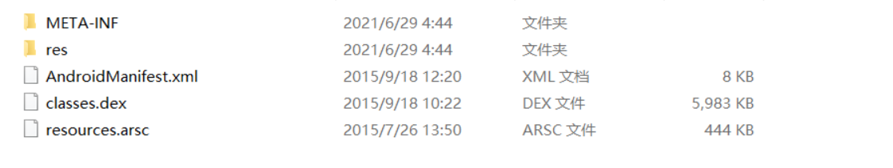  
* 将`classes.dex`移至`dex2jar`  
* `d2j-dex2jar.bat classes.dex` 完成相应的格式转换  
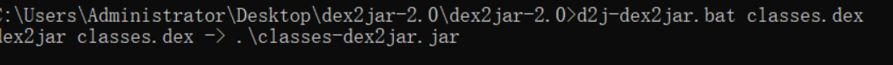  
* 使用`JADX-GUI`打开`classes-dex2jar.jar`  
* `adb shell`执行命令`am broadcast -a theBroadcast -n com.android.insecurebankv2/com.android.insecurebankv2.MyBroadCastReceiver --es phonenumber 5554 –es newpass`  
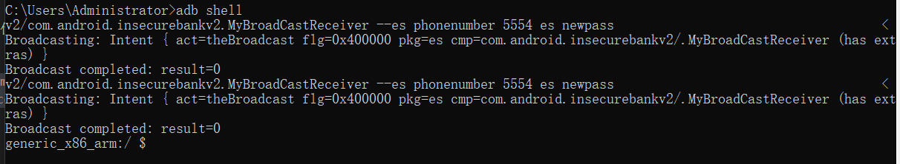  
### Exploiting Android Content Provider  
* 使用自带用户名密码`jack/Jack@123$`登录  
* 查看反编译后的`AndroidManifest.xml`寻找细节  
* 使用`JADX-GUI`打开`classes-dex2jar.jar`  
* `adb shell`执行命令`content query --uri content://com.android.insecurebankv2.TrackUserContentProvider/trackerusers`  
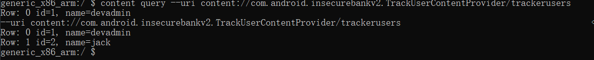  

## 参考资料  
[教材第八章实验](https://c4pr1c3.github.io/cuc-mis/chap0x08/main.html)  
[第八章教学视频](https://www.bilibili.com/video/BV1rr4y1A7nz?from=search&seid=6142859782746666446)  
[逆向工具 d2j-dex2ja 教程](https://www.fujieace.com/kali-linux/courses/d2j-dex2ja.html)